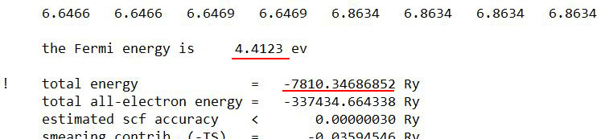

# ML4MSD - Homework 1
*Created By*: Prof. Peter Schindler<br>
*Due*: Monday, 9/22/2025, 11:59 pm

## Overview

In this first homework, we will implement some of the basic Python skills we learned in class on more practical problems. One topic we have not covered during the lecture is opening, reading, and writing files. Hence, this homework will focus on these aspects while also utilizing the basic concepts we covered during the lectures (like lists, strings, and dictionaries). We will also use a few built-in Python libraries, like `os`, `pathlib`, and `json`.

## Generative AI Usage

As mentioned during class, if you are a Python beginner, I'd advise to avoid the usage of GenAI. Instead, use StackExchange or Google to get specific information that you need to solve the problem at hand. Alternatively, you can ask GenAI something like *"For a problem that involves reading/writing files in Python, which aspects would be helpful for me to know?"* or *"For error message "XYZ", what are possible causes?"* or *"What is a context manager in Python?"*. 

If you are already comfortable with Python usage, feel free to use GenAI as much as you see fit.

## Setting up and Submitting Your Homework Submission

- Make sure you have created the homework repository on GitHub, like we discussed in class, and that you either invited me as a collaborator or sent me the link via email.
- You can select the same Python interpreter that we used in the main `ML4MSD-Files` repository, or alternatively, copy the `uv.lock` and `pyproject.toml` files to your homework repository and then run `uv sync` in your homework folder to regenerate the same Python environment.
- Fetch the most recent version of the `ML4MSD-Files` repository.
- Copy all files from the `ML4MSD-Files/Homework/Homework1/` folder to your `ML4MSD-HW-<yourname>/Homework1/` folder by using the File Explorer (Windows) or Finder (on Mac).
- To create an empty Jupyter notebook file (optional, because you could also submit your homework solutions in a simple .py file - up to you):
    - Press Ctrl + Shift + P
    - Type "Create: New Jupyter Notebook" and click it
    - Click "File" > "Save as" and save this empty notebook file in your `ML4MSD-HW-<yourname>/Homework1/` folder
- Once you are done with the homework, stage all changes, commit the changes, and push to your remote repository
- Then copy the link to your repository and submit it on the Canvas homework assignment.

## Assignments

### Assignment 1

The folder `results` contains the result of 11 density functional theory (DFT) calculations of mine. The goal of this exercise is to traverse the files in these folders and create a summary dictionary and save it as a JSON file. To do so:

- Traverse the subfolders in the `results` folder with the function `walk` of the built-in `os` Python package (see info [here](https://docs.python.org/3/library/os.html#os.walk)) and store all file paths in a list. For working with paths you may want to consider using the `pathlib` package (see info [here](https://www.pythonmorsels.com/pathlib-module/)), but this is optional (plain strings with the `os.path.join` function work too).
- Loop through the path list and open the `log.txt` and `duration.txt` files with a context manager (i.e., use: `with open("log.txt", "r") as f:`). Further information on opening and writing files can be found [here](https://www.geeksforgeeks.org/python/difference-between-modes-a-a-w-w-and-r-in-built-in-open-function/) and [here](https://docs.python.org/3/tutorial/inputoutput.html#reading-and-writing-files). 
    - Inside a `log.txt` file: Search through the lines of text for the *"the Fermi energy is"* and the *"total energy"* and save each value in a variable. (see screenshot below) Remember the string methods `split` and `strip`, which may be helpful to clean up the string and then convert it to a float value.

    
    - Inside a `duration.txt` file: Take the first line which is of form `hour:minutes:seconds` and convert it to seconds and save it in an integer variable.
- Be careful about the case that the required information is not available (one of the files encountered an error during DFT calculation, and hence the required values are not available). One option is to use the `try` and `except` approach. Another approach is to use the `finally` clause in the `for` loop that contains a `break` statement once a value is found (and if no value is found, the `finally` block will run).
- Save all the collected information from all folders in a dictionary that has the folder name as an integer key and the corresponding value is another dictionary that contains the keys "duration_seconds" (with an integer value), "Fermi_energy" (with a float value), "total_energy" (with a float value), and "error" (with a boolean value). The final dictionary should look something like this (the values may of course look different, but the structure should look basically the same):
```Python
results = {
    0: {
        "duration_seconds": 478, 
        "Fermi_energy": 4.743, 
        "total_energy": -7056.654239, 
        "error": False
        }, 
    1: {
        "duration_seconds": 1289, 
        "Fermi_energy": 7.047, 
        "total_energy": -6429.00935, 
        "error": False
        },
    2: {
        "duration_seconds": None, 
        "Fermi_energy": None, 
        "total_energy": None, 
        "error": True
        },
     ...
     }
```


- Finally, save that dictionary to a JSON file using the built-in `json` package utilizing a context manager (similar to how you opened files).


### Assignment 2

Utilize Python to automate a task you have done in the past. This can be anything you previously did manually, but now can automate using Python. A few random examples, to give you an idea of what that could be:

- Read some CSV output files that you obtained by an experimental device and do basic analysis. Can use the `csv` package here. For XLSX files there is a library called `openpyxl`, but it is not a built-in library (i.e., you would need to install it). It may be easier to convert your XLSX files to CSV, in that case.
- Copy files from one folder to another (e.g., for backup or sorting purposes). This could utilize the `os`, `pathlib`, and `shutil` built-in packages.
- Using the `input` statement you could write a basic Python script that converts one set of units to another set of units.
- Be creative! Anything you have done previously that required manual repetition on a computer/files, can be automated with Python!

### Assignment 3

Go through the `ML4MSD-Files/Resources/Python_resources.md` file and summarize any interesting observations or things you learned from it.

## Evaluation

I will grade your homework submission based on how I perceive your effort:
- 0%: Very little or no effort
- 50%: Basic/average effort (tried to make an effort)
- 100%: Effort is evident
