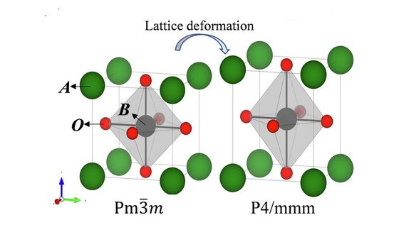
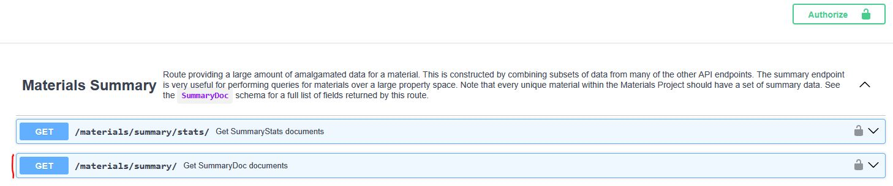

# ML4MSD - Homework 3
*Created By*: Prof. Peter Schindler<br>
*Due*: Monday, 10/13/2025, 11:59 pm

## Overview

In the third homework, we will practice using the Pymatgen package to create and manipulate crystal structures. Further, we will use the Materials Projects API to query materials data.

## Generative AI Usage and Setting up and Submitting Your Homework Submission

Same as homework 1.

## Assignments

### Assignment 1

Let us create perovskite structures using Pymatgen. For the cubic perovskite phase of type $\mathrm{ABO}_3,$ A is located at the corners of the cube (fractional coordinates: 0, 0, 0) [green], B is located at the body center (fractional coordinates: 0.5, 0.5, 0.5) [gray], and oxygen is located at the face centers (fractional coordinates: 0.5, 0.5, 0; 0.5, 0, 0.5; and 0, 0.5, 0.5) [red]. The tetragonal phase looks similar, just that the c unit cell vector is now longer than the a/b vectors. See the illustration below (taken from [here](https://www.nature.com/articles/s41524-024-01496-z)).



Please, create a function that generates the Pymatgen structures of both the cubic and tetragonal pervoskite phases. In the function, the user should be able to specify the element for A, the element for B, the c/a ratio for the tetragonal phase and whether or not CIF files should be saved for the structures. Please, also check that the spacegroups of the two generated structures are correct. 

Run your function for the example `A="Ba"`, `B="Ti"`, and `c_to_a_ratio=1.3` and add the generated CIFs to your repository submission.

The function should look something like this:

```Python
def generate_perovskites(A: str, B: str, c_to_a_ratio: float, save_cifs: bool = True) -> (Structure, Structure):
    # Your code here:
    # Create both structures
    # Check that both generated structures exhibit the correct spacegroups (see image above)
    if save_cifs:
        # save both structures as cifs
    return cubic_pervoskite, tetragonal_perovskite

cperov, tperov = generate_perovskites("Ba", "Ti", 1.3)
print(cperov)
print(tperov)
```

### Assignment 2

Using `MPRester`, query for all materials that are not metals and that are not theoretical. Request the fields `'material_id', 'band_gap', 'symmetry'` as well as a **field that contains the information whether or not the material has a direct band gap or not**. The list of all possible fields (and query constraints) can be found [here](https://api.materialsproject.org/docs), under the summary endpoint (`/materials/summary/`, see screenshot below). Click on that and scroll down to `_fields` to see a full list of possible fields that you can request for your query (identify the one which returns the information on whether a material has a direct or indirect band gap).



When this data is stored in the variable `data`, restructure the data with the code we saw during the lecture:

```Python
flattened = [{k: v for k, v in dict(d).items() if v is not None} for d in data]
mpids = pd.DataFrame.from_records(flattened)
mpids['symmetry.crystal_system'] = mpids['symmetry'].apply(lambda x: str(x.crystal_system).lower())
mpids = mpids.dropna(axis=1, how='all')
mpids = mpids.drop(columns=['symmetry', 'fields_not_requested'])
mpids.to_csv('mp_hw_data.csv')  # optionally saving to a csv file (so you don't have to re-query the data)
```

Now, working with the `mpids` dataframe, please plot the percentage of materials in each crystal system (stored in column `'symmetry.crystal_system'`) that has a direct band gap (using the information in column `is_gap_direct`). What trends do you observe?

Now plot the average band gap for the two categoies `"Direct Band Gap"` and `"Indirect Band gap"`. Do you observe a pronounced difference or not?

### Assignment 3

Please, go through the two papers: `Resources/Papers/Scheffler_Nature_22_FAIR Data and MSE.pdf` and `Resources/Papers/Wang_Chem_Mat_20_Best Practices ML.pdf`. As you go through them, please use the highlighter tool in your PDF viewing software and mark a few sentences that seem critical to you. Add the two PDFs with your highlights to the repository before submission.

### Assignment 4

Please, go through the [sites module](https://github.com/materialsproject/pymatgen/blob/master/src/pymatgen/core/sites.py) of Pymatgen and identify the OOP concepts that we covered in class. Summarize what this module does and which dunder methods they utilize (some of which we haven't discussed in class and some we have). What's the difference between a `Site` and a `PeriodicSite`?

A list of *all* dunder methods in Python can be found [here](https://www.pythonmorsels.com/every-dunder-method/).

## Evaluation

I will grade your homework submission based on how I perceive your effort:
- 0%: Very little or no effort
- 50%: Basic/average effort (tried to make an effort)
- 100%: Effort is evident